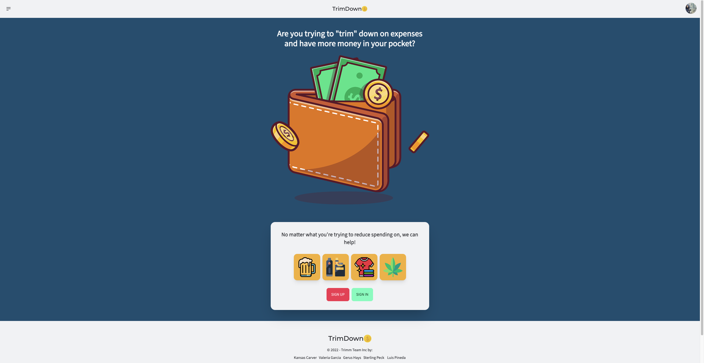
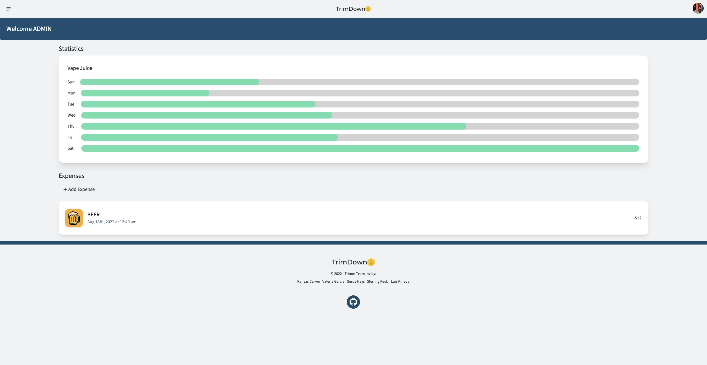

# Trim-Down

## Description
This website was created to assist users in managing their personal finances. Hopefully alleviating some un-needed "wants" of your day to day expenses.

## Screenshot:

## Table of Contents
* [Technologies Used](#technologies-used)
* [Installation](#installation)
* [Usage](#usage)
* [Future Development](#future-development)
* [Tests](#tests)
* [Web Link](#web-link)
* [Powerpoint](#powerpoint)
* [Contributing](#contributing)
* [Questions](#questions)

## Technologies Used
* Express
* CSS
* JavaScript
* Node
* Tailwind
* DaisyUI
* React
* Bcrypt
* Heroku
* GraphQL
* Mongoose

## Installation
The user will have to npm install the packages and then run the server. 
Or they may utilize the live link below.

## Usage
Using this will assist users in managing their personal finances. 
In doing so this app will track their expenses of everything they are spending money on they do not need and allow them to see a visual representation of their expenses.

## Future Development
* Make the application into a PWA to enable offline functionallity.
* Include statistics on the expenses to see the users spending habits and watch them improve after using our app.
## Tests
This application was tested periodically throughout creation to ensure that it was functioning properly.

## Web Link

## PowerPoint
[google docs powerpoint](https://docs.google.com/presentation/d/1EfVwaP_1f4fG2HiAorfX3qdFlVrHJxX61729DSiTmAA/edit?usp=sharing)

## Contributing
https://github.com/GerusHays Gerus Hays 
https://github.com/vhivestate Valeria Garcia 
https://github.com/lrpineda Luis Pineda 
https://github.com/khcarver1 Kansas Carver 
https://github.com/sterlingpeck Sterling Peck 

## Questions
Questions about this project? Reach out to one of us:
gerushays@gmail.com 
 
luicks212@gmail.com 
 
